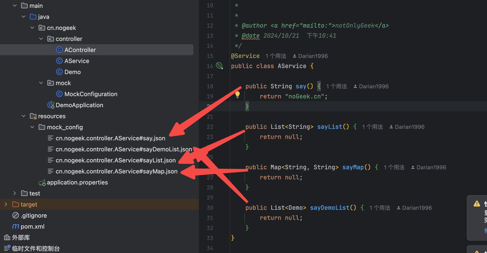

::: tip 背景


我们后端代码一般都是在 Spring 框架之上的，我们写完代码之后，偶尔需要自己进行本地测试的时候，想直接进行接口测试，测试自己的流程，又不想依赖二方服务还有一些 Redis 之类的技术组件。让我们进行快速的走完我们自己的流程进行测试。

基于此，我开发了这个工具，万能的 Mock 工具，只要是个 Spring 的 bean，就可以进行 Mock

:::


仓库地址

- https://github.com/nogeek-cn/mock-everything
- https://gitee.com/nogeek-cn/mock-everything


## 使用方法

在对应的 resource 文件下 创建 ` "全类名" + "#" + “方法名” + “.json”` 文件就行了，写下你的返回值，就可以进行 Mock 了，

例如：

`cn.nogeek.controller.AService#sayDemoList.json`  就是对 `cn.nogeek.controller.AService`  l类的方法 `sayDemoList` 方法进行 Mock 返回值

```json
[
    {
        "name": "nogeek.cn"
    },
    {
        "name": "umlcn.com"
    },
    {
        "name": "umlcn.com"
    }
]
```

基础类、List、Map 等等返回值都可以生效




## 直接效率起飞


::: tip 背景

工具代码放在你们工程目录下的时候，`工具类` 和 `Mock 文件` 记得 添加到 `.gitignore` 文件哦。不要上传到远程仓库哦

:::


## 快去 给个 star，体验一下吧


