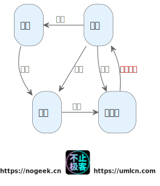

# 大家都在追求名望？

其实想一想，人的一生，大家都在追求名望

- 上学的时候，全家都努力争取让孩子进名校
- 大学毕业，努力面试进入大公司
- 国企招标时，绝大多数情况都是大公司竞标
- 看病时，尽管名医很贵，但是能看名医还是看名医

这其实都是**名望**以及**名望带来的代价**

> 名望: 为人仰望的名声
>

# 先看名校

为什么大家会想尽全家的努力把孩子送进名校，无非就是，名校本身带来的一些好处：比如，**更多的资源、更好的老师、更牛逼的同学**。这些就是名校能够带给学生的。

在学校成为名校的过程中，一定是一个循环的过程。

名校吸引好学生、好老师；
好学生、好老师提升学校的名气
名校吸引更好的学生、吸引更好的老师

当这个飞轮转动起来的时候，**名校**就呼之欲出了。

**但是进入名校是要有代价的**。要考更高的分数，要送更多的金钱，要有更牛逼的亲戚，你才能进入名校。

对于绝大多数名校来说，他们本身也知道，不是所有考高分的学生就是他们最希望招到的学生，但是在应试的规则之中，他们依然会选择用分数来衡量，因为**分数衡量比较简单**。

总不能把每年 1千多万的考生，全部来一次面试吧？那得耗费多大的精力。**你拼尽全力，考了个高分，进入了名校。也仅仅是进入了名校罢了**。

> 名校的声望吸引学生

# 再看大公司

大家毕业了，就会想着进入大公司。可是：每一个大公司都是从小公司成长出来的。

招牛逼的员工，公司变大；
公司变大：就有希望吸引更厉害的员工。

这就是公司需要成为大公司的螺旋道路。

**但是进入大公司是要有代价的**。要从名校毕业、要创立一家大公司看得上的公司被大公司收购。

这些规则就是为了筛选，**快速的筛选更有可能符合大公司的要求的人**。大公司的 HR 和老板本质上有不同的利益诉求。

- 老板的利益诉求：我希望能够招到更有能力的员工，能够为公司带来更大的效益
- HR的诉求：我希望我能够招进来一个员工，这个员工符合招聘手册的要求，如果有天发现这个员工是一个蠢才，那么对不起，不怨我，我也是按照招聘手册来进行招聘的。为了更快地进行招聘，那么就把招聘的门槛提高，快速筛选出来更少的人，争取不用面试，就让某个人可以直接进来。**老板事前很满意就行了，事后老板不满意又不能怨我就好了**。

这就是现实中的**屁股决定脑袋**。他们坐在不同的位置上，有不同的想法，这个是正常的。 **大公司也有足够的金钱去试错，招聘的人不满足需求，那就裁掉，重新招聘呗？不行就多招点，反正公司的钱不是HR的钱**。

> 大公司的声望吸引名校的学生
> 名校的声望也会让大公司付出招聘到高分低能的代价（但这个代价是HR可以接受的）

# 再看国企招标

为什么大多数中标的公司都是大公司？因为在国企领导的心中：**大公司更有可能把事情做成**。

往往很大的公司，都会有他们的核心产品，只有他们的核心产品是他们的核心竞争力。大公司之所以成为大公司，在他们核心产品的外围，会有很多边缘产品。**如果，国企中标的是他们公司的边缘产品，那么其实很大可能质量并不怎么样**。

作为国企领导来说：“**关于这个项目，我已经为国家找了一个看起来牛逼可靠的公司了，能不能做好就不是我的事情了**”。如果可以做好，那么因为国企领导眼光好，找到了好公司；如果没有做好，那就可以说：“**这个大公司就做不好，别的公司肯定也做不好**”。**所谓的大公司，只是国企领导的风险转移到他们身上而已**。

其实，上边的话是由逻辑上的误区的。

- **招标的是大公司**  !=  **做项目的是大公司的核心员工**
- **项目的实施者** != **大公司的核心人员**
- **项目的质量** != **大公司的牌子的尖端质量**

**大公司用核心产品赢得名望，再低质产品卖出高价钱。国企领导因为大公司的名望而讲自己的风险转移出去了。**

> 这就是为什么在这种非市场经济下，很多能够中标的大公司的老板都有很多背景。即使他们口头上连连否定，即使他们中标的产品质量那么低，可是他们依然可以中标。其中的弯弯绕绕，只有亲身经历才能体会到。
>

当然，换位思考，如果让你坐上国企领导，你估计也会这样子。

---

还有一个大佬讲过的某故事，某个国企大集团想要开展某一块的业务，但是没有好的实施方式，所以，他们就去市面上，找了很多家公司，让他们去做一些很简单的事情，来考察他们。经历了一轮筛选，筛选出来一批公司，再交给他们一些项目，继续做，经历长达三年的合作，最后敲定某个团队是这个大集团需要的团队。然后高价把这个团队全部招进大公司。

就是经过长时间地筛选，他们找到了他们希望找到的团队。**不看名望，只看实际能力，但是付出了试错的成本以及时间的代价**：他们付出了几年的事情，以及被筛选掉的团队的合作费用。

# 名望的获取本身就是有代价的

**获取名望本身就是有代价的**：考上清华北大是不是要付出代价？考上斯坦福、麻省理工是不是意味着更大的付出？

**着重名望来评价也是有代价的**：名校毕业的学生平均就是别普通的学校毕业的学生贵；大公司待过的员工平均的招聘成本就是比只在小公司呆过的员工贵。

这就是**名望本身的罪与罚**。

# 金钱、地位、名望

社会对个人的世俗评价更多偏重于：**金钱、地位、名望**。

我们一旦在**金钱、地位、名望**中占据一角，就可以相互转化。

> 例如直播间：“我是大公司里的什么什么职位的员工，所以我出了本书，你看一看，也能进入大公司。”

其实，这里边逻辑也是有漏洞的，大v的学历和你一样吗？大V进入大公司的时期是现在吗？他现在还能进入大公司吗？是不是他现在也不符合大公司的招聘要求了呢？

**我并没有否定“终身学习”。终身学习永远没有错**

我只是觉得，**对个体而言：不要迷信名望**。

> 在一些事情上，只看名望的代价，对个人来说，代价太大，个人是承担不起的。

# 终身学习

要坚持终身学习，名望只是你终身学习的一个附属品。

